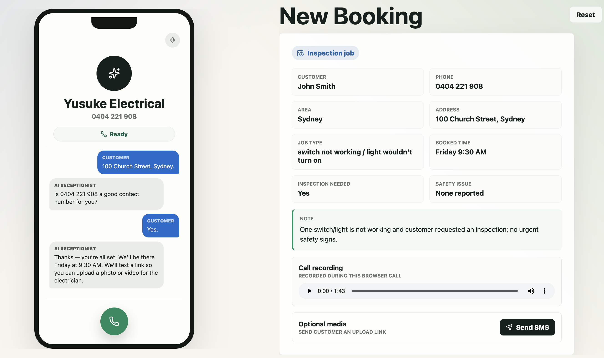

# TradieTwin MVP

TradieTwin is a tradie's profitable twin for every missed call.

This MVP demonstrates an AI phone agent that answers missed residential electrician calls and turns them into confirmed bookings.

The app simulates a customer phone call in the browser. A customer speaks to the AI agent, the live transcript appears in an iPhone-style interface, and the app generates a booking card after the call ends.



## What It Does

- Runs a browser-based missed-call intake demo for a residential electrician.
- Uses ElevenLabs Conversational AI for speech intake and agent responses.
- Uses ElevenLabs text-to-speech as a reliable spoken-response fallback.
- Shows live customer and AI transcript bubbles.
- Extracts booking details from the completed call with OpenAI.
- Displays a New Booking card with customer, phone, area, address, job type, booking time, inspection status, safety issue, and note.
- Records the browser call locally and shows a call recording player on the booking card.
- Includes a local photo/video upload preview after the simulated SMS upload link is sent.

## Demo Flow

1. Customer starts the call in the browser.
2. AI asks how it can help.
3. Customer describes the electrical issue.
4. AI asks for suburb, safety context, booking time, name, address, and phone confirmation.
5. Customer ends the call.
6. The New Booking card appears with extracted job details.
7. Optional media can be attached for electrician context.

## Tech Stack

- Next.js
- React
- ElevenLabs Conversational AI
- ElevenLabs text-to-speech
- OpenAI for final booking extraction
- Local browser state only

## Environment

Create a `.env` file from `.env.example`:

```bash
cp .env.example .env
```

Required values:

```bash
OPENAI_API_KEY=
OPENAI_MODEL=gpt-5.4-mini

ELEVENLABS_API_KEY=
ELEVENLABS_AGENT_ID=
ELEVENLABS_VOICE_ID=
ELEVENLABS_USE_VOICE_OVERRIDE=false
ELEVENLABS_MODEL_ID=eleven_multilingual_v2
```

## Run Locally

```bash
npm install
npm run dev
```

Open:

```text
http://localhost:3000
```

## Build

```bash
npm run build
```

## Notes

This is a demo-only MVP. It does not send real SMS, create calendar events, store customer data, or integrate with field-service software.
